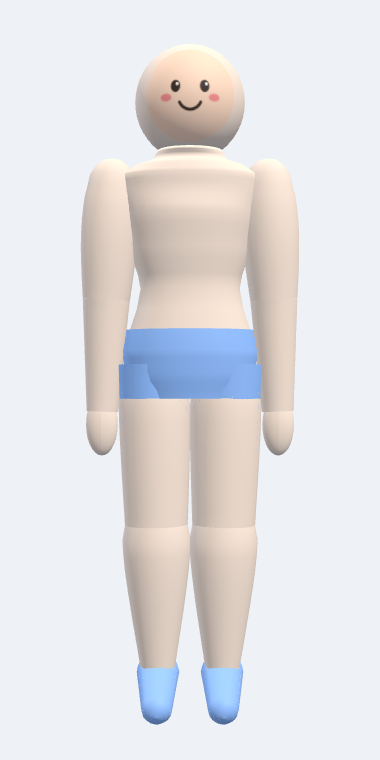
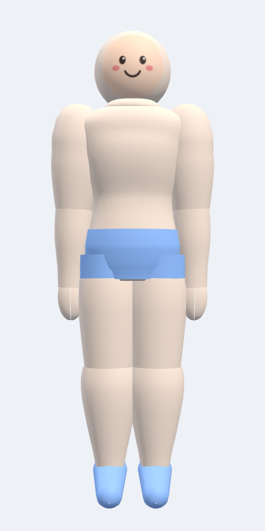
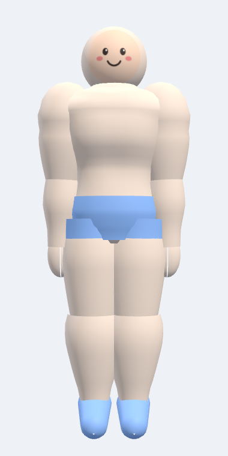
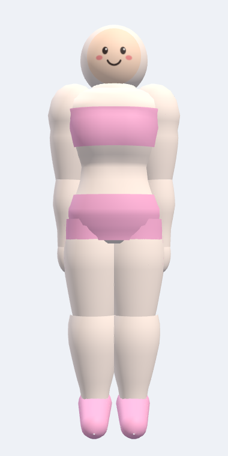
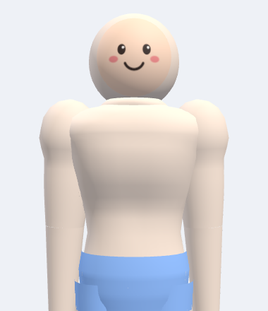
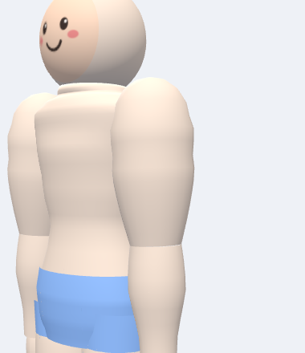
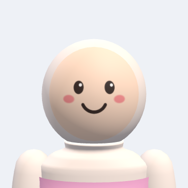

# fitahead-model

FitAhead의 Flutter 3D 캐릭터 — 모델 에셋과 그 도메인 모델.

운동 동기부여가 목적인 캐릭터입니다. 사용자가 운동하면 **해당 부위가 실제로 커지고**,
부위별로 **카메라를 클로즈업**해서 변화를 확인할 수 있습니다.

| 시작 | 성장 중 | 성장 후 |
|:---:|:---:|:---:|
|  |  |  |

| 여성 프리셋 | 부위 확대 (가슴) | 부위 확대 (팔) | 얼굴 |
|:---:|:---:|:---:|:---:|
|  |  |  |  |

---

## 무엇이 들어있나

```
assets/models/          생성된 에셋 (커밋됨)
  male.glb  female.glb    스킨 + 모프 타겟이 포함된 캐릭터
  face_default.png        기본 얼굴 (사용자 그림으로 교체 예정)
  character_manifest.json 런타임 매니페스트 — 조인트 / 모프 / 카메라 프레이밍

tools/                  에셋 생성기 (Python, 외부 의존성 0)
  gen_character.py        엔트리포인트
  fitahead_gen/           지오메트리 · 리그 · 모프 · glTF/PNG 라이터

packages/fitahead_character/   Dart 도메인 패키지 (Flutter/3D 의존성 없음)
  매니페스트 파싱 · 성장 모델 · 부위별 카메라 프레이밍
```

## 빠른 시작

```bash
# 에셋 재생성 (Python 3.8+, 외부 패키지 불필요)
python3 tools/gen_character.py

# 도메인 패키지 테스트
cd packages/fitahead_character && dart pub get && dart test
```

## 핵심 개념 3가지

**1. 모프 타겟 = 성장**
9개 근육 그룹(`chest` `back` `shoulders` `arms` `abs` `glutes` `thighs` `calves`)과
전체 체격(`bulk`)이 각각 0..1 가중치를 가집니다. `belly`는 반대 방향 — 체성분에서 옵니다.

**2. 매니페스트 = 계약**
앱은 조인트 인덱스나 모프 인덱스를 하드코딩하지 않습니다. 전부 `character_manifest.json`에서
읽습니다. 매니페스트는 GLB와 같은 스크립트가 같은 시점에 생성하므로 어긋날 수 없습니다.

**3. 얼굴 = 교체 가능한 텍스처**
얼굴은 별도 메시(`Face`) + 별도 머티리얼입니다. UV가 0..1 정사각형을 꽉 채우므로
정사각형 이미지를 그대로 넣으면 원형으로 잘려 얼굴 위치에 정확히 올라갑니다.
사용자가 그린 그림을 붙이려면 이 텍스처만 갈아끼우면 됩니다.

자세한 설계 근거와 다음 단계는 [docs/CHARACTER_DESIGN.md](docs/CHARACTER_DESIGN.md)를 보세요.

## 현재 상태

- [x] 남/여 파라메트릭 캐릭터 생성기
- [x] 부위별 성장 모프 타겟 10종
- [x] 22개 조인트 스켈레톤 (스키닝 완료, Khronos 검증기 통과 — 에러/경고 0)
- [x] 교체 가능한 얼굴 플레이트
- [x] 부위별 카메라 프레이밍 (성장 여유분 포함)
- [x] Dart 도메인 패키지 + 테스트 54개
- [ ] **렌더러 선택** — 아래 참고
- [ ] 아이들/운동 애니메이션 클립
- [ ] 의상·헤어 커스터마이징

### 렌더러는 아직 정해지지 않았습니다

이 레포는 의도적으로 렌더링 엔진에 의존하지 않습니다. GLB는 표준 glTF 2.0이라
어떤 엔진에서도 열리고, `fitahead_character` 패키지는 순수 Dart입니다.
후보와 트레이드오프는 설계 문서의 "렌더러 선택" 절에 정리해 두었습니다.
