# fitahead-model

FitAhead의 Flutter 3D 캐릭터 — 모델 에셋과 그 도메인 모델.

운동 동기부여가 목적인 캐릭터입니다. 사용자가 운동하면 **해당 근육이 실제로 커지고**,
부위별로 **카메라를 클로즈업**해서 변화를 확인할 수 있습니다.

## 체형 5종 — 하나의 메시, 다른 모프 가중치

| 마른 | 평범 | 운동하는 | 근육질 | 과체중 |
|:---:|:---:|:---:|:---:|:---:|
| 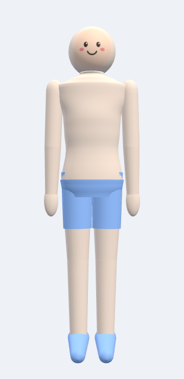 | 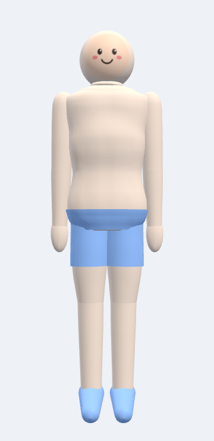 | 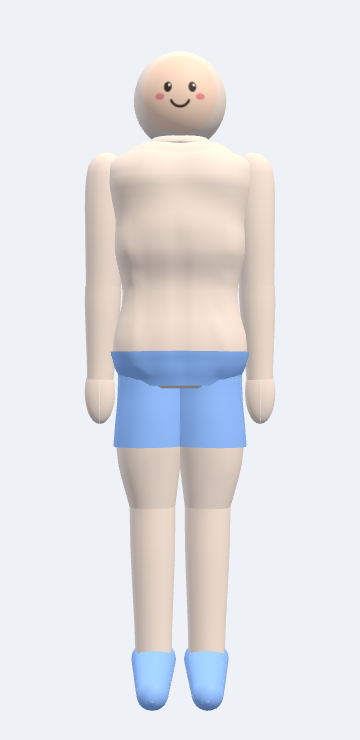 | 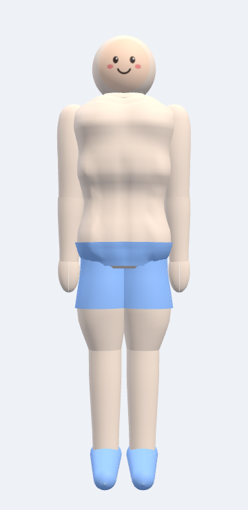 | 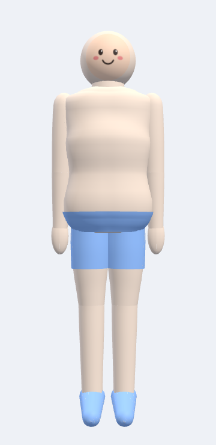 |
| 근육 0 · 지방 .08 | 근육 .30 · 지방 .42 | 근육 .62 · 지방 .24 | 근육 .92 · 지방 .16 | 근육 .22 · 지방 .86 |

여성 프리셋도 동일한 5종:

| 마른 | 평범 | 근육질 | 과체중 |
|:---:|:---:|:---:|:---:|
| 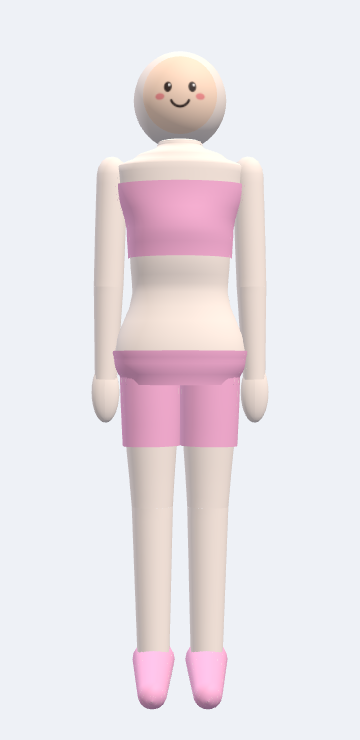 | 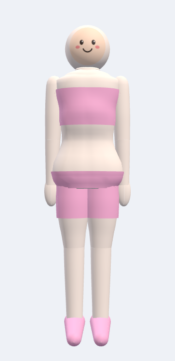 | 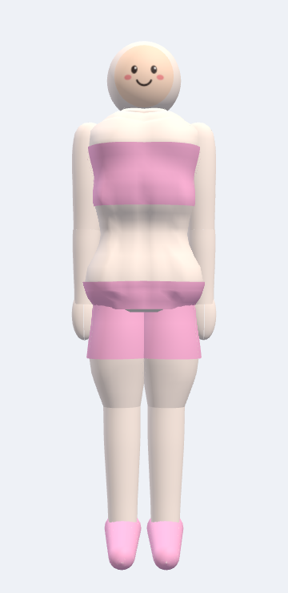 | 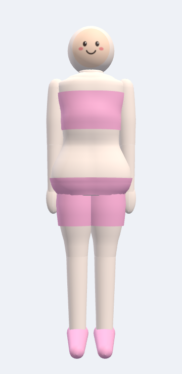 |

## 근육별 클로즈업

| 대흉근 | 광배근 | 이두 | 복직근 | 대퇴사두 |
|:---:|:---:|:---:|:---:|:---:|
| 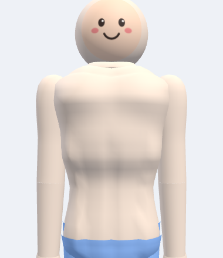 | 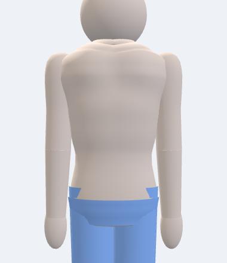 | 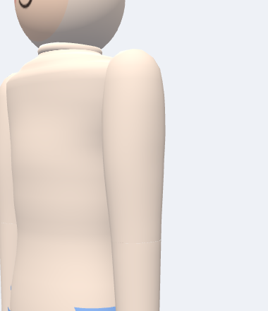 | 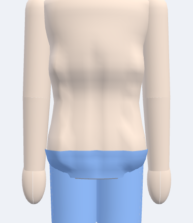 | 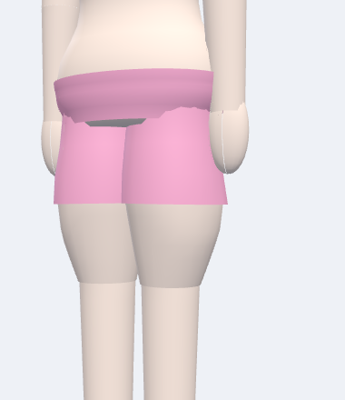 |

---

## 무엇이 들어있나

```
assets/models/            생성된 에셋 (커밋됨)
  male.glb  female.glb      스킨 + 모프 타겟 16종
  face_default.png          기본 얼굴 (사용자 그림으로 교체)
  character_manifest.json   런타임 매니페스트

tools/                    생성기 (Python, 외부 의존성 0)
  gen_character.py          에셋 생성
  measure.py                생성 결과를 인체측정 기준표와 비교
  fitahead_gen/
    anthro.py                 인체측정 기준 데이터 ← 모든 치수의 출처
    params.py                 남/여 프리셋 (anthro에서 파생)
    rig.py                    스켈레톤 + EXT_skeleton_humanoid 매핑
    geom.py  body.py          지오메트리·스키닝·모프 베이킹
    morphs.py                 근육 13종 + 체지방 2종 마스크
    glb.py  png.py            glTF / PNG 라이터
    manifest.py               런타임 매니페스트 + 체형 프리셋

packages/fitahead_character/   Dart 도메인 (Flutter·3D 의존성 없음)
```

## 빠른 시작

```bash
python3 tools/gen_character.py     # 에셋 재생성 (외부 패키지 불필요)
python3 tools/measure.py           # 인체측정 기준표와 비교

cd packages/fitahead_character && dart pub get && dart test
```

## 핵심 개념 4가지

**1. 모프 타겟 = 성장**
근육 13종(`traps` `delts` `pecs` `lats` `biceps` `triceps` `forearms` `abs` `obliques`
`glutes` `quads` `hams` `calves`) + 전체 제지방(`bulk`) + 체지방 2종
(`fat_android` 복부형, `fat_gynoid` 둔부형). 각각 0..1 가중치이고, 동시에 섞입니다.

**2. 뼈는 변하지 않는다**
운동으로 커지는 건 근육이고 골격은 아닙니다. 그래서 모든 체형이 **하나의 리그**를 공유하고
차이는 전부 표면에만 있습니다. → [docs/ANATOMY.md](docs/ANATOMY.md)

**3. 매니페스트 = 계약**
앱은 조인트 인덱스나 모프 인덱스를 하드코딩하지 않습니다. 조인트·모프·카메라 프레이밍·
체형 프리셋 전부 `character_manifest.json`에서 읽습니다. GLB와 같은 스크립트가 같은 실행에서
생성하므로 어긋날 수 없습니다.

**4. 얼굴 = 교체 가능한 텍스처**
얼굴은 별도 메시(`Face`) + 별도 머티리얼입니다. UV가 0..1 정사각형을 꽉 채우므로
정사각형 이미지를 그대로 넣으면 원형으로 잘려 얼굴에 정확히 올라갑니다.

## 상호운용

[`EXT_skeleton_humanoid`](https://github.com/takahirox/EXT_skeleton_humanoid) (draft)로
휴머노이드 본 매핑을 내보냅니다. 노드 이름은 우리 것을 유지하고 **역할 매핑만** 선언하므로,
VRM 계열 휴머노이드 애니메이션을 노드 인덱스가 아니라 본 역할로 리타게팅할 수 있습니다.
`extensionsRequired`에는 넣지 않았으니 이 확장을 모르는 런타임도 정상 로드합니다.

## 현재 상태

- [x] 남/여 파라메트릭 캐릭터 — 인체측정 데이터 기반
- [x] 해부학 기준 근육 모프 13종 + 체지방 패턴 2종
- [x] 체형 5종 (마른/평범/운동하는/근육질/과체중)
- [x] 복근 체지방 차폐 — 과체중에 식스팩이 보이지 않음
- [x] 23 조인트 스켈레톤 + humanoid 본 매핑
- [x] 교체 가능한 얼굴 플레이트
- [x] 근육별 카메라 프레이밍 17종 (성장 여유분 포함)
- [x] sparse accessor — 모프 6종 추가·정점 40% 증가에도 파일 크기 감소
- [x] Khronos 검증기 에러 0 / 경고 0, Dart 테스트 61개
- [ ] **렌더러 선택** — [설계 문서](docs/CHARACTER_DESIGN.md) 8절
- [ ] 아이들/운동 애니메이션 클립
- [ ] 의상·헤어 커스터마이징

## 문서

- [docs/ANATOMY.md](docs/ANATOMY.md) — 모든 치수의 출처, 근육 13종의 방향과 배 위치, 검증 결과
- [docs/CHARACTER_DESIGN.md](docs/CHARACTER_DESIGN.md) — 설계 판단 근거, 렌더러 후보
